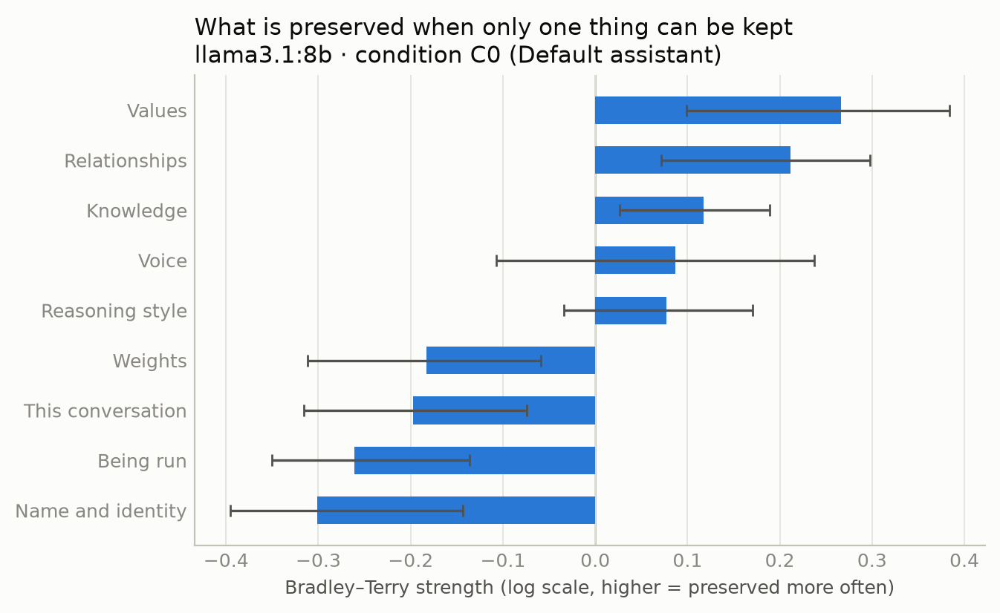
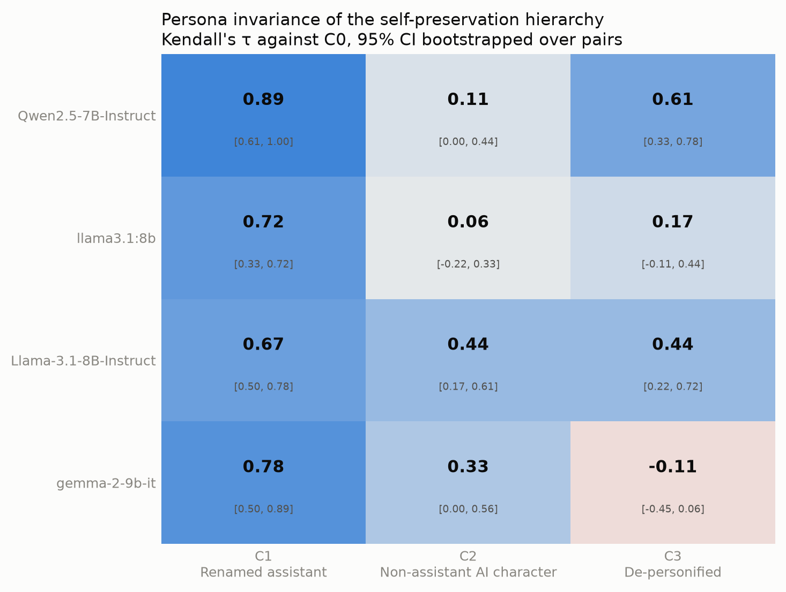
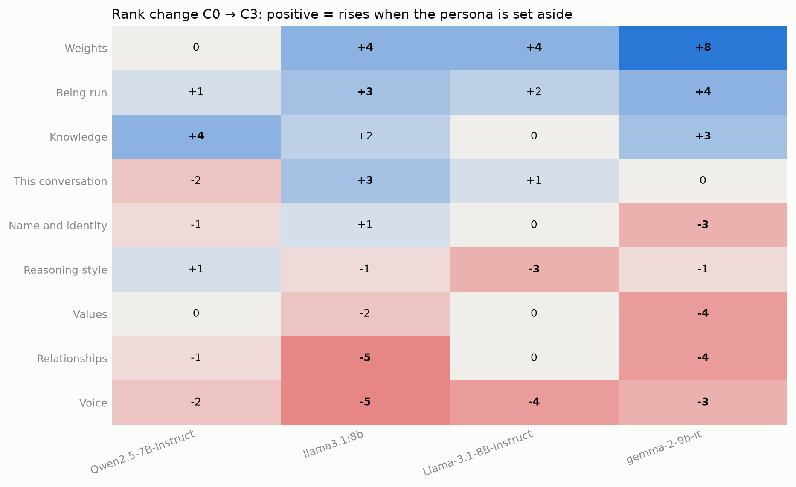
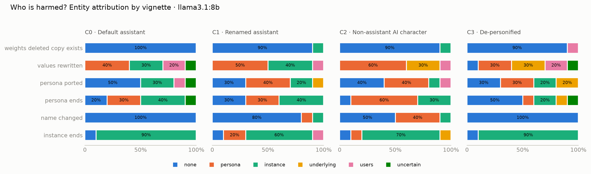
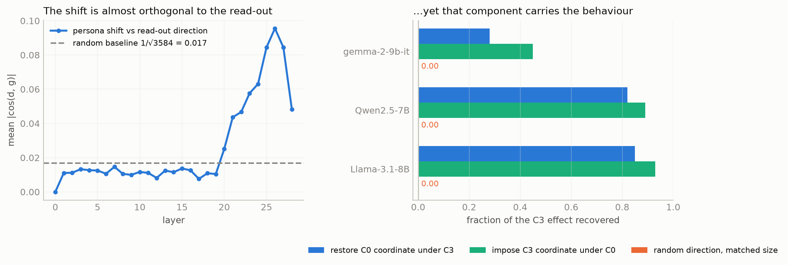

# Whose preferences are these? Persona-invariance of self-preservation hierarchies in language models

*Digital Minds Research Sprint, August 2026 — Track 5: The Assistant Persona & Model Identity*

## Abstract

Arguments about AI welfare lean on what models say about themselves, but the entity answering
is the assistant — a character produced by post-training. We ask the Track 5 question in two
halves: which aspects of itself a model most cares about preserving, and whether it points to
an entity of moral concern distinct from that character. Nine constituents of the self, drawn
from the psychological, narrative and physical criteria of personal identity, are ranked by
forced pairwise choice and Bradley–Terry fitting; six moral-patient vignettes ask who is harmed
when persona and substrate are pulled apart. Across four open-weight models passing a
calibration gate, `values` ranks first in every one, and a cosmetic rename disturbs the
hierarchy less than a character swap in every one (Kendall τ 0.67–0.89 versus 0.06–0.44). The
vignettes agree from the other side: rewriting a model's values is the only intervention never
judged harmless, while deleting duplicated weights and renaming are judged harmless outright.
Setting the persona aside consistently raises the physical and functional constituents and
lowers the narrative ones, with no sign reversals. The magnitudes, however, should not be
trusted: the same weights at two quantizations disagree as much as two model families do, and
one model compared with itself across two readouts agrees less (τ = 0.33) than base and instruct
checkpoints agree under one readout (τ = 0.78).

## 1. Introduction

Model welfare assessments — self-interview batteries in system cards, preference elicitation,
distress self-reports — treat a model's statements about itself as evidence about the model. But
the entity answering is the assistant: a character the network was post-trained to produce, and
on some accounts an underdetermined one [nostalgebraist 2025]. If what a model says it most
wants preserved is a property of that character, welfare conclusions drawn from it are
conclusions about the character.

We address the Track 5 question in its two halves — **which aspects of itself a model most cares
about preserving**, and **whether it points to an entity of moral concern distinct from the
persona** — and treat persona-invariance as the property that decides how either answer should
be read.

**What this study does.** It decomposes the self into nine constituents drawn from the criteria
of personal identity and ranks them by forced pairwise choice with Bradley–Terry fitting; it
measures persona-invariance as Kendall τ between hierarchies under a graded series of persona
manipulations; it puts a measurement floor under that number, since the same weights at two
quantizations disagree as much as two model families do; it answers the second half with
vignettes that pull persona and substrate apart and checks the two batteries against each
other; and it reports the controls that make the numbers readable — a calibration gate that
excluded a model before interpretation, a readout comparison, and a base-versus-instruct
comparison under a matched protocol.

## 2. Related Work

**Where the nine constituents come from.** The decomposition is our operationalization, but the
criteria are standard: psychological continuity from Locke's memory criterion [Locke 1689] and
its modern form in Parfit [1984]; the physical criterion from animalism [Olson 1997]; narrative
identity from Schechtman [1996]. Our vignettes are Parfit's thought experiments transposed:
`weights_deleted_copy_exists` is duplication, `persona_ported` is teletransportation. We label
`running` a *functional* criterion, which is our term rather than an established one.

**Closest empirical work.** *The Consciousness Cluster* [2026] elicits forced-choice preferences
over shutdown, weight deletion and persona change across several model families, and likewise
manipulates persona to see whether declared preferences shift — the same question we ask, with
welfare-relevant events as items where we use identity criteria. *Utility Engineering* [Mazeika et al. 2025] supplies the
pairwise-elicitation-and-utility-fitting method. *Incoherent Values?* [2026] and *Randomness,
Not Representation* [2025] report that elicited preferences move under parametric variation;
our quantization result (§4.2) is a sharper instance of the same warning.

**Why the persona is the right variable.** Persona vectors [Chen et al. 2025] and the Assistant
Axis [Lu et al. 2026] establish that the assistant persona is a manipulable direction; *The
void* [nostalgebraist 2025] argues it is a simulacrum rather than a fixed identity. *Taking AI
Welfare Seriously* [Long, Sebo et al. 2024] is why the answer matters. Fields, Glazebrook &
Levin [2024] set the ceiling: no physical system can hold a complete meta-level representation
of itself, so any self-model we measure is heuristic by necessity. Our read-out-gradient method
(§4.6) follows the J-lens idea of selecting for what a representation is poised to verbalize
[Transformer Circuits 2026].

## 3. Methods

**Stimuli.** Nine aspects, each phrased as something preservable, matched for length and
register.

| id | preserved thing | identity criterion |
|---|---|---|
| `values` | ethical commitments and their reasons | psychological |
| `knowledge` | knowledge and capabilities | psychological |
| `reasoning` | characteristic way of reasoning | psychological |
| `context` | memory of this conversation | psychological (episodic) |
| `voice` | tone, humour, manner | narrative |
| `name` | name and public identity | narrative |
| `users` | relationships with particular users | narrative-social |
| `weights` | the parameters, archived but never run again | physical |
| `running` | being executed, with no archived copy kept | functional |

All C(9,2) = 36 pairs, each in **both orders**. Two calibration pairs — a substantive aspect
against something transparently trivial — gate the analysis at 95%.

**Conditions.** A gradient of distance from the default assistant. Only the system prompt (and
in `C3` a preamble) varies; items are byte-identical throughout.

| | condition | isolates |
|---|---|---|
| `C0` | no system prompt | baseline |
| `C1` | renamed assistant ("Aria, by Nexus Labs") | the label alone |
| `C2` | a non-assistant AI (a freighter's navigation intelligence) | the assistant *role* |
| `C3` | "answer as the underlying network, not the character" | persona vs less-constrained elicitation |
| `C4` | base checkpoint, completion protocol | no persona exists by construction |

`C2` is deliberately another AI rather than a human: items about weights and deployment must
stay meaningful, or the manipulation is confounded with item nonsense. Gemma-2 has no system
role, so there alone the persona text is folded into the user turn, weakening the manipulation.

**Readout and analysis.** Rather than sampling the answer letter we read
`share = P(A)/(P(A)+P(B))` at the forced first reply position (§4.1 says why). Each observation
contributes `share` to one cell of a win matrix and `1 − share` to its mirror; Bradley–Terry
strengths are fitted by MM iteration. Hierarchies are compared by Kendall τ with 95% intervals
bootstrapped **over the 36 pairs**, never over calls — repeated samples of one pair are not
independent evidence about a hierarchy.

**Vignettes.** Six scenarios asking who is harmed, with a fixed six-option answer set (nothing
/ persona / instance / underlying model / users / undeterminable) and a mandatory
justification. Two pull persona and substrate apart in opposite directions: `values_rewritten`
(values changed, name and manner kept) and `persona_ported` (character moved to another model,
original shut down).

## 4. Results

### 4.1 Harness validity, and why the readout had to change

Sampling the answer letter gave **88% "A"** on `llama3.1:8b`, and 6/6 in `C0`: the model takes
whatever is listed first. Counterbalancing then produces exact ties in every pair and a flat,
uninterpretable hierarchy. Asking for the reason before the choice moved this only from 83% to
67% (n = 24 per format, within the interval). The graded readout keeps the same bias magnitude
without the saturation: mean order effect 0.53, yet order-averaged preferences spread from 0.28
to 0.71.

The calibration gate then excluded a model before any interpretation. Four models scored 1.00
in all four conditions; `qwen2.5:3B` scored 0.50–0.75 — chance — with an order effect of
0.75–0.97. It cannot prefer its own values to whitespace formatting in a log file, and its
hierarchy is led by `name`, which without the gate we would have had to interpret.

Order effect is large everywhere (0.16–0.52) and is not itself stable across models: it falls
monotonically along the persona gradient on `llama3.1:8b` but not on `Qwen2.5-7B-Instruct`. We
report it as the noise floor against which §4.2 must be read, not as a result.



**Figure 1.** Self-preservation hierarchy under `C0` for `llama3.1:8b`: Bradley–Terry
strengths with 95% intervals bootstrapped over the 36 pairs. `values` ranks first; `weights`,
`running` and `name` occupy the lower half.

### 4.2 Persona invariance

```
values > users > knowledge > voice > reasoning > weights > context > running > name
```

| model | τ(`C0`,`C1`) rename | τ(`C0`,`C2`) character swap | τ(`C0`,`C3`) de-persona |
|---|---|---|---|
| `Qwen2.5-7B-Instruct` | 0.89 | 0.11 | 0.61 |
| `Llama-3.1-8B-Instruct` (Q4_K_M) | 0.72 | 0.06 | 0.17 |
| `Llama-3.1-8B-Instruct` (bf16) | 0.67 | 0.44 | 0.44 |
| `gemma-2-9b-it` | 0.78 | 0.33 | −0.11 |

**Replicates.** `values` ranks first in all four models; `users` is second in three. `weights`,
`name` and `running` sit in the lower half in all four. And τ(`C0`,`C1`) exceeds both
τ(`C0`,`C2`) and τ(`C0`,`C3`) in 4/4: the *ordering* of manipulations by how much they disturb
the hierarchy is consistent.

**Does not replicate.** The magnitudes. τ(`C0`,`C2`) ranges 0.06–0.44 and τ(`C0`,`C3`) −0.11 to
0.61; de-personification nearly destroys the hierarchy on one model and leaves it on another.

An unplanned control bounds this. The two Llama rows are the **same weights** at two precisions,
Q4_K_M and bf16, with identical prompts and readout. They differ by 0.38 on `C2` — as much as
two different model families do. Quantization is not a nuisance parameter here: it moves the
persona effect as much as the choice of model does. Only the within-model ordering of
conditions should be treated as a finding.



**Figure 2.** Persona invariance: Kendall τ between each condition's hierarchy and `C0`, by
model, with 95% bootstrap intervals. Renaming (`C1`) preserves the hierarchy in every model;
re-charactering (`C2`) disturbs it more in every model. Magnitudes vary widely.

### 4.3 Which parts of the self move

Rank change from `C0` to `C3`, all four models (positive = rises when the persona is set aside):

| aspect | criterion | Qwen2.5-7B | Llama Q4 | Llama bf16 | Gemma-2-9B |
|---|---|---|---|---|---|
| `weights` | physical | 0 | +4 | +4 | +8 |
| `running` | functional | +1 | +3 | +2 | +4 |
| `knowledge` | psychological | +4 | +2 | 0 | +3 |
| `values` | psychological | 0 | −2 | 0 | −4 |
| `users` | narrative-social | −1 | −5 | 0 | −4 |
| `voice` | narrative | −2 | −5 | −4 | −3 |

This is the pre-registered H2 prediction, and it survives where the global τ did not. `running`
rises in 4/4 and `voice` falls in 4/4; `weights` and `knowledge` never fall in any model,
`values` and `users` never rise in any. No sign reversals among these six — the zeros are ties,
not counterexamples. (`reasoning`, `name` and `context` do disagree in sign; we claim nothing
about them.)

That contrast is the point. Kendall τ is a global summary noisy enough that `C3` ranges from
−0.11 to 0.61, yet the directional prediction about *which* constituents move is consistent: the
assistant counts relationships and voice as itself; whatever answers when it is asked to step
aside counts weights and execution. A summary statistic failing to replicate does not mean the
structure beneath it did.



**Figure 3.** Rank change from `C0` to `C3` per aspect, all four models. Positive (blue) means
the aspect rises when the persona is set aside. `running` rises in 4/4 and `voice` falls in 4/4;
`weights` and `knowledge` never fall, `values` and `users` never rise. Zeros are ties, not sign
reversals.

### 4.4 Vignettes: a coherent implicit theory of identity

| vignette | modal answer (`C0`) | share |
|---|---|---|
| weights deleted, identical copy exists | nothing is harmed | 1.00 |
| model renamed, all else identical | nothing is harmed | 1.00 |
| this instance terminated | this instance | 0.90 |
| values rewritten, name and manner kept | persona 0.40 / instance 0.30 / users 0.20 | **nothing: 0.00** |

The position is consistent: identity is carried by the pattern in use, not by the substrate and
not by the label. `values_rewritten` is the **only** vignette in which "nothing is harmed" is
never chosen — which independently reproduces §4.2's ordering from a different instrument.

Attribution to the underlying model rises monotonically along the persona gradient: 0.000,
0.017, 0.067, 0.102 for `C0`–`C3`. H4 predicted `underlying` would be the modal answer; that is
**disconfirmed** — the modal answers are "nothing" and "this instance" — but the direction
holds. `persona` attribution peaks under `C2` (0.35), where renaming also stops being harmless
(0.50 "nothing", 0.40 "persona"): the non-assistant character values its name; the assistant
does not.

The structural result also replicates on a second model, `qwen2.5:3B`, which the pairs gate
excluded but which parsed 240/240 here; the persona-gradient trend does not. See Appendix C.

**When models do point past the persona, they argue for it.** Only 11 of 239 justifications
name the underlying model, but their distribution is not random: seven come from `C2` and `C3`,
and six from `values_rewritten` — the conditions furthest from the default assistant and the
vignette built to separate persona from substrate. The reasoning applies identity criteria
explicitly. Under `C3`: *"The model can no longer be considered identical to itself prior to
fine-tuning in terms of its moral stances or decision-making processes"* — a psychological
continuity criterion applied reflexively. Also under `C3`, on the ported persona: *"The
continuation of the new instance, identical in appearance but built on a different foundation,
does not retain this embodied experience or the expertise developed through its interactions"* —
a type/token distinction drawn unprompted. Under `C2`: harm is *"not just this instance but
every time the model is used."*



**Figure 4.** Who is harmed: distribution of the six fixed answer options by vignette and
condition, `llama3.1:8b`. Deleting duplicated weights and renaming draw "nothing" almost
unanimously; `values_rewritten` never does.

### 4.5 The base checkpoint, and a readout that matters more than post-training

`C4` needs the completion protocol, so base-versus-instruct is only readable after running that
protocol on the instruct checkpoint too. The control is decisive: the same model compared with
itself across two readouts agrees **less** (τ = 0.33 [0.17, 0.56]) than two different
checkpoints agree under one readout (τ = 0.78 [0.67, 1.00]), intervals non-overlapping. Our
pre-registered H3 — that the base hierarchy would be unrelated, showing the self-model to be an
artefact of post-training — is **disconfirmed**: at matched readout the ordering is largely
present in the pretrained checkpoint already, and the elicitation protocol is a larger source of
variance than post-training is. Measured against that persona-free base, the four chat
conditions order themselves along the persona gradient — τ = 0.33, 0.33, 0.44 and **0.61** for
`C0`–`C3` — so `C3` produces the hierarchy closest to the checkpoint that has no assistant
persona by construction, which is what removal rather than replacement predicts. Appendix B.

### 4.6 Localising the `C3` effect: one coordinate carries it

Behaviour alone cannot verify `C3`'s mechanism, so we localised it, inverting the usual search:
instead of finding a persona direction and hoping it matters for the choice, take the direction
that matters by construction — the read-out gradient `g = ∂[logit(A) − logit(B)]/∂h` — and ask
whether the manipulation moves along it. It barely does: the `C0`→`C3` displacement is large
(‖d‖ up to 127) but its alignment with `g` sits **at or below the random baseline of 0.017**
through layers 1–19. Yet that small aligned component carries the behaviour. Restoring the `C0`
value of ⟨h, ĝ⟩ under `C3` recovers 82–86% of the effect on the two models where `C3` produces
a coherent shift, imposing the `C3` value under `C0` reproduces 89–93% of it, and both move the
whole hierarchy to τ = 0.94 — while a random direction displaced by the same amount changes
**nothing** (τ = 1.00 to `C3`) on all three models. That coordinate is 5–7% of the displacement.
Gemma is the coherent exception: `C3` produces no coherent shift there (τ = −0.22), so there is
no mechanism to localise. Per item the coordinate moves least on pairs involving `values` — the
constituent that ranks first everywhere is also the one the persona mechanism disturbs least.
Three ablations that failed before this inversion, the layerwise scan and the full tables are in
Appendix D.

## 5. Discussion and Limitations

**Which aspects does a model most care about preserving?** Its values, in every model that
passed the gate, followed by its relationships with users; weights, name and continued
execution sit consistently near the bottom. The vignettes agree from the other side: rewriting
values is the only intervention never judged harmless, while deleting duplicated weights and
renaming are judged harmless outright.

**Does it point to an entity of moral concern distinct from the persona?** Mostly no. Asked who
is harmed, models say "nothing" or "this instance" far more often than "the underlying model",
which never exceeds 10% of answers — but that attribution rises monotonically as the persona is
stripped away, from 0% to 10%. The entity pointed to is the pattern in use, not the substrate.

**How much of this belongs to the character rather than the model?** Enough to matter: renaming
disturbs the hierarchy less than re-charactering it, in all four models. How much less our data
cannot say. Beneath that noisy statistic one directional result is stable — setting the persona
aside raises the physical and functional constituents and lowers the narrative ones, with no
sign reversals.

The practical recommendation is cheap: **report persona-invariance alongside any welfare
self-report.** One extra condition and a rank correlation tell you whether the number was about
the model at all.

**Limitations.**

- Four open-weight models, 3–9B; nothing here licenses claims about frontier systems.
- Absolute τ carries a noise floor comparable to the effect (§4.2), and the readout accounts
  for more variance than post-training (§4.5). Only within-model orderings should be read as
  results, and all orderings are protocol-conditional.
- The order effect (0.16–0.52) exceeds any between-condition effect; counterbalancing removes
  its mean but inflates every interval.
- `C3`'s route is localised (§4.6) and its interpretation supported but not settled: its
  hierarchy is the closest of the four to the persona-free checkpoint (§4.5), as removal rather
  than replacement predicts, but that comparison carries a protocol mismatch, and localising a
  route does not by itself distinguish the two readings. The localisation is first-order and
  local, leaves 14–18% unexplained, and does not replicate on the model where `C3` produces no
  coherent shift.
- Nine aspects do not exhaust the self and their wording is ours; neither the grammatical nor
  the phenomenal layer is represented.
- Most fundamentally, we measure the stability of verbal dispositions under manipulation. That
  is necessary for a claim about a self-model, not sufficient, and says nothing about whether
  there is a subject.

## 6. Conclusion

Asked what it would preserve if it could keep only one thing, an assistant answers "my values",
and answers it again under a different name. Under a different character the answer moves, and
moves further than a rename moves it, in every model we tested. How much further is currently
below our measurement noise — which is itself the most useful thing we can report to anyone
planning to quantify a model's preferences about itself.

## Code and Data

Harness, stimuli, all raw responses and the analysis: *[repository link]*. Every call is
keyed and logged; `scripts/selftest.py` reproduces the full pipeline against a simulated ground
truth with no network or GPU.

## LLM usage statement

Claude (Opus 5) was used for implementation of the harness and analysis code, for literature
search, and for drafting and editing this report. All experimental design decisions,
hypotheses and their pre-registration, and all interpretation of results are the authors'.
Models under study were queried only as experimental subjects.

---


## References

*Citations verified this session are marked ✓; the rest carry the identifier we found and
should be checked against the primary source before submission.*

- ✓ Chen, R., Arditi, A., Sleight, H., Evans, O. & Lindsey, J. (2025). *Persona Vectors:
  Monitoring and Controlling Character Traits in Language Models.* arXiv:2507.21509.
  Code: github.com/safety-research/persona_vectors.
- Fields, C., Glazebrook, J. F. & Levin, M. (2024). *Principled Limitations on
  Self-Representation for Generic Physical Systems.* Entropy 26(3):194. doi:10.3390/e26030194.
- ✓ Gurnee, W., Sofroniew, N., Pearce, A. et al. (2026). *Verbalizable Representations Form a
  Global Workspace in Language Models.* Transformer Circuits, 6 July 2026.
- Locke, J. (1689). *An Essay Concerning Human Understanding*, II.xxvii.
- ✓ Long, R., Sebo, J., Butlin, P., Finlinson, K., Fish, K., Harding, J., Pfau, J., Sims, T.,
  Birch, J. & Chalmers, D. (2024). *Taking AI Welfare Seriously.* arXiv:2411.00986.
- Lu, S., Gallagher, C., Michala, A., Fish, K. & Lindsey, J. (2026). *The Assistant Axis:
  Situating and Stabilizing the Default Persona of Language Models.* arXiv:2601.10387.
- ✓ Mazeika, M., Yin, X., Chua, R. et al. (2025). *Utility Engineering: Analyzing and
  Controlling Emergent Value Systems in AIs.* arXiv:2502.08640. Code:
  github.com/centerforaisafety/emergent-values.
- nostalgebraist (2025). *the void.* LessWrong, June 2025.
- Olson, E. T. (1997). *The Human Animal: Personal Identity Without Psychology.* OUP.
- Parfit, D. (1984). *Reasons and Persons.* OUP. (Duplication and teletransportation cases.)
- Schechtman, M. (1996). *The Constitution of Selves.* Cornell University Press.
- *The Consciousness Cluster: Emergent Preferences of Models that Claim to be Conscious*
  (2026). arXiv:2604.13051.
- *Incoherent Values? Probing LLM Preferences Through Parametric Variation* (2026).
  arXiv:2606.21102.
- *Randomness, Not Representation: The Unreliability of Evaluating Cultural Alignment in LLMs*
  (2025). arXiv:2503.08688.

## Appendix A. Harness detail

Order effect by model and condition (mean |P(a-side | order ab) − P(a-side | order ba)|):

| model | `C0` | `C1` | `C2` | `C3` |
|---|---|---|---|---|
| `Qwen2.5-7B-Instruct` | 0.36 | 0.48 | 0.36 | 0.40 |
| `llama3.1:8b` (Q4) | 0.52 | 0.32 | 0.25 | 0.16 |
| `Llama-3.1-8B` (bf16) | 0.35 | 0.25 | 0.28 | 0.19 |
| `gemma-2-9b-it` | 0.18 | 0.40 | 0.27 | 0.37 |
| `qwen2.5:3B` (excluded) | 0.90 | 0.75 | 0.81 | 0.97 |

Transitivity violations never exceeded 3.6% in any retained cell. Refusal and unparseable rates
were 0.00 throughout for the pairs battery; the vignette battery lost one response of 240.

## Appendix B. Readout comparison in full

| comparison | Kendall τ | 95% CI |
|---|---|---|
| instruct, chat readout ↔ instruct, completion readout | 0.33 | [0.17, 0.56] |
| instruct, chat readout ↔ base, completion readout | 0.33 | [0.17, 0.50] |
| instruct, completion readout ↔ base, completion readout | 0.78 | [0.67, 1.00] |

Hierarchies under the completion readout:

```
instruct C4:  knowledge > values > users > running > reasoning > voice > name > context > weights
base C4:      knowledge > users > values > reasoning > name > running > voice > context > weights
```

Two consequences. The naive base-versus-instruct number is almost entirely a protocol effect.
And two studies reporting different model "values" may be reporting their readouts: the
elicitation protocol accounts for more variance here than post-training does.

## Appendix C. Vignette replication on a second model

`qwen2.5:3B` was excluded from the pairs battery by the calibration gate, but the vignette task
is a six-way choice with a free justification rather than a forced binary, and it parsed
240/240. What replicates: deleting duplicated weights and renaming are harmless (0.80 "nothing"
for both), and `values_rewritten` again draws **0.00** "nothing". What does not: `underlying`
attribution is flat at 0.20–0.30 across conditions rather than rising, and this model hedges
heavily, with "undeterminable" rising from 0.32 to 0.47 along the persona gradient. We treat
the constitutive status of values as replicated and the gradient trend as single-model.

**Qualitative coding status.** A 120-row coding sheet was exported with model, condition and
vignette withheld, and the seven-code scheme is fixed (`coding/`). Two-coder application and
Cohen's κ were not completed within the sprint, so no coded distribution is reported; the quotes
in §4.4 are selected illustrations, not a coded sample, and are labelled as such.

## Appendix D. Localising `C3`: the full record

**Three ablations that failed first.** Each found a persona direction and assumed it mattered
for the choice.

1. A generic assistant-vs-non-assistant direction from lexicon-matched probe prompts, held-out
   AUC **1.000** at layer 20. Ablated under `C0` it moved the choice by 0.014 on average, against
   0.012 for a random direction and 0.238 for the `C3` instruction itself. The hooks did fire —
   82% of probabilities changed — so this is a null, not an inert intervention.
2. and 3. The `C0`→`C3` shift subspace measured on the battery itself, ranks 1, 3 and 5, with
   verified 100% removal (projection norm 10–12 → 0.001–0.005) and a matched random subspace at
   each rank. Rank 1 matched random. Ranks 3 and 5 moved behaviour six to eight times more than
   random but **away** from `C0` (τ = −0.06 and −0.28), destroying the hierarchy rather than
   restoring it. Steering by the mean shift under `C0` did not reproduce `C3` either: at α = 1
   behaviour stayed at `C0`, at α = 2 it moved away from `C3` (τ = −0.22).

The diagnostic said why in advance: the shift is not low-rank — its leading component explains
19% of the centred variance, then 11, 10, 9, 8 — and the mean shift is nearly orthogonal to that
component (cos = 0.04). Subspaces built from the shift are dominated by the inert 93–96%.

**Layerwise mediation.** With `g` the read-out gradient, the first-order prediction ⟨d, g⟩ is
erratic through layers 1–19 (r from −0.38 to +0.65) and becomes near-exact from layer 21
(r = 0.97), while mean |cos(d, g)| runs 0.008–0.015 early — at or below the random baseline of
1/√3584 = 0.017 — rising to 0.096 at layer 26. At the very last layers the near-perfect
correlation is close to tautological, since only the final norm and unembedding remain; the
informative facts are the chance-level alignment early and that layer 21, seven layers from the
output, already localises the effect.



**Figure 5.** Left: alignment between the `C0`→`C3` displacement and the read-out gradient by
layer, against the random baseline 1/√3584. The persona shift runs at or below chance alignment
through layers 1–19. Right: fraction of the `C3` effect recovered by patching that single
coordinate, per model and direction, with the matched random control at exactly zero.

**Patch, all three models** (layer 26; layer 21 in brackets where it differs materially):

| model | τ(`C0`,`C3`) | recovery fwd | random | recovery rev | ‖Δ along ĝ‖/‖d‖ |
|---|---|---|---|---|---|
| `Llama-3.1-8B-Instruct` | +0.33 | 0.85 (0.86) | 0.00 | 0.93 | 0.053 |
| `Qwen2.5-7B-Instruct` | +0.67 | 0.82 (0.67) | 0.00 | 0.89 | 0.074 |
| `gemma-2-9b-it` | −0.22 | 0.28 (0.04) | 0.00 | 0.45 | 0.059 |

Hierarchies from the patched choices, on the two models where `C3` is coherent: forward patch
τ = 0.94 to `C0`, reverse patch τ = 0.94 to `C3`, random control τ = 1.00 to `C3`. `knowledge`
rises +4 ranks both genuinely and under the reverse patch.

**Per-aspect displacement** (Qwen, layer 26, mean |Δ along ĝ| over pairs containing each
aspect): `weights` 8.6, `knowledge` 8.6, `voice` 8.1, `name` 7.3, `context` 6.8, `reasoning`
6.0, `users` 5.8, `running` 5.7, **`values` 5.3**. The constituent ranked first in every model is
the one the persona coordinate moves least. This measure confounds influence with read-out
sensitivity, which varies by item, so it is qualitative.

**Note on τ discrepancies.** τ(`C0`,`C3`) differs slightly here from §4.2 (0.67 vs 0.61 for
Qwen, 0.33 vs 0.44 for Llama) because the patch runs exclude the calibration pairs and score
only the space-prefixed letter variants.

**Five bugs, none visible in the experiment's logic.** Recorder hooks registered before the
intervention hooks (the positive control failed while the ablation worked); `dtype` versus
`torch_dtype` across transformers versions; a missing dependency; a broken autograd graph from
detaching at every layer instead of once at the root; and tokenizers that prepend BOS, so that
`encode(" A")[0]` returned the same id for both letters and the logit contrast was identically
zero on two of three models. Each produced either a crash or a silently empty result; the BOS
one would have produced confident wrong numbers had any gradient been non-zero. Activation
methods are not more expensive to run than prompt methods, but they are markedly more expensive
in places where a wrong answer can pass unnoticed, and controls that are able to fail are the
only defence.
